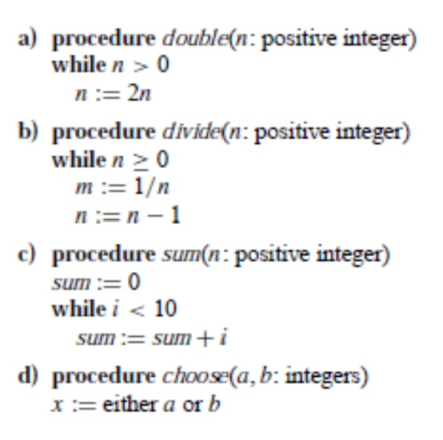

# Algorithms 1 - exercises

## Exercise 1 - Algorithmic Problems

a. Select and discuss a real-world problem in which only the best solution will do. Then
come up with one in which approximately the best solution is good enough.

Our answer: Autonomous vehicle safety 
In the context of autonomous vehicles, only the best solution will suffice in a complex and dynamic environment, where the margin of error is extremely low. 

GPS is a real world problem where it is not required to always be the best route that the algorithm comes up with, it just has to be good enough that you can get to your location in a reasonable time span. 

b. Describe a real-world problem in which sometimes the entire input is available before
you need to solve the problem, but other times the input is not entirely available in
advance and arrives over time.

our answer: Natural disasters, such as hurricanes, earthquakes and wildfires are real-world problems that sometimes involve varying degress of input availability. The nature of these disasters means that the entire input is not always available in advance.

## Exercise 2 - Algorithm Characteristics/Requirements

Which characteristics of an algorithm (see slide 4) do the procedures a - d below have and which
do they lack?

algorithm A
For this algorithm to run n has to be bigger than 0
This algorithm will never stop once it starts as it has no break condition. 
The algorithm is correct in terms of producing the correct output for the individual inputs.

algorithm B
This algorithm has a break condition in terms that it is solvable before we grow too old. 
The steps are also defined precisely 

algorithm C
This algorithm doesn't work has it will never enter the while loop because i is not defined in the function.

algorithm D
This algortihm is a random choice algorithm who chooses either a or b given in the function and returns the choosen as x in the function. 
So it has a finite number of steps is precisely defined and is correct, adaptable, robust and maintanable overall a good algorithm for it's purpose.

## Exercise 3 - Algorithm Problem Specification:
a. Which of the following are valid instances of the search problem?

i. sequence ⟨2, 8, 10, 9, 15, 20, 14⟩, and an integer, ⟨−20⟩
-20 is not found in the array so precondition $P_1$ (slide 13) is not met, however, precondition $P_2$ is met.
A `notFoundException` should be thrown.
Valid search problem.

ii. sequence ⟨−2, 800, 10, 90, 14⟩, and an integer, ⟨100⟩
Same as question a.i.

iii. sequence ⟨5, `a` 4, 9, 15⟩, and an integer, ⟨`a`⟩.
`a` is found in the array, so precondition $P_1$ is met.
Output should follow postcondition $Q_2$.
Valid search problem.

iv. sequence ⟨5, 98, 4, 9, 15⟩
There is no $v$ given, so this is not a valid search problem.

v. sequence ⟨⟩ and integer, ⟨5⟩
Length of the array is not a positive integer, so this is not a valid search problem.

b. Consider the problem of adding two n-bit binary integers, stored in two n-element arrays
A and B. The sum of the two integers should be stored in binary form in an (n+1)-
element array C. Specify the problem formally.

Precondition:
- $n$: a positive integer.
- $A$ and $B$: bit arrays of length $n$, where entries are either 0 or 1.

Postcondition:
- $C$: an $n+1$ length bit array corresponding to the sum of the two integers represented by $A$ and $B$.

Constraints:
- Inputs and other variables have not changed.

c. Specify each of the following tasks as an algorithmic problem (including pre-conditions,
post-conditions, and constraints). Indicate whether a potential solution to the problem
involves: sorting or searching operations.

i. **Route optimization in GPS navigation**: Calculate optimal routes in real-time,
considering factors like traffic, road closures, and shortest distance.

Precondition:
- $G$: A graph where nodes are road intersections and edges are roads connecting said intersections.
The edges are given weights as a weighted sum of their distances, amount of road closures, and amount of traffic.

Postcondition:
- Output is the solution to the shortest path problem minimizing the weight of the chosen path.

Constraints:
- Algorithm must run in near-real-time.

ii. **Scheduling of online food delivery orders**: Schedule all received orders in a
way that minimizes the total delivery time.

iii. **E-commerce recommendations**: Analyze user preferences and behaviors to
suggest relevant products.

iv. **Data compression**: compress data to reduce file sizes while preserving essential
information.

## Exercise 4 - Algorithmic Efficiency

a. What is the smallest value of $n$ such that an algorithm whose running time is $100n^2$ runs
faster than an algorithm whose running time is $2^n$ on the same machine?

Intercept at 

Solve for $n$ in the equation $100n^2 = 2^n \implies \lceil n \rceil = 15$.

b. Suppose that for inputs of size $n$ on a particular computer, algorithm $A$ runs in $8n^2$ steps
and Algorithm $B$ runs in $64n\log(n)$ steps. For which values of $n$ does algorithm $A$ beat
algorithm $B$?

Solve for $n$ in the equation $8n^2 = 64n\log(n) \implies n = 43.6$.
So algorithm $A$ is faster for $n\le43$ and algorithm $B$ is faster for $n\ge44$.

c. For each function $f(n)$ and time $t$ in the following table, determine the largest size $n$ of a
problem that can be solved in time $t$, assuming that the algorithm to solve the problem
takes $f(n)$ microseconds.

|$f(n)$         |1 second       |1 minute           |1 hour              |1 day                |1 month                |1 year                |1 decade               |
|---------------|---------------|-------------------|--------------------|---------------------|-----------------------|----------------------|-----------------------|
|$\log(n)$      |$e^{10^6}$     |$e^{60 \cdot 10^6}$|$e^{3.6 \cdot 10^9}$|$e^{86.4 \cdot 10^9}$|$e^{2.6 \cdot 10^{12}}$|$e^{31 \cdot 10^{12}}$|$e^{3.1 \cdot 10^{15}}$|
|$\sqrt{n}$     |$10^{12}$      |$3.6 \cdot 10^{15}$|$13 \cdot 10^{18}$  |$7.5 \cdot 10^{21}$  |$6.8 \cdot 10^{24}$    |$961 \cdot 10^{24}$   |$9.61 \cdot 10^{30}$   |
|$n$            |$10^6$         |$60 \cdot 10^6$    |$3.6 \cdot 10^9$    |$86.4 \cdot 10^9$    |$2.6 \cdot 10^{12}$    |$31 \cdot 10^{12}$    |$3.1 \cdot 10^{15}$    |
|$n\cdot\log(n)$|$88 \cdot 10^3$|$4 \cdot 10^6$     |$190 \cdot 10^6$    |$3.9 \cdot 10^9$     |$103 \cdot 10^9$       |$1.12 \cdot 10^{12}$  |$96.3 \cdot 10^{12}$   |
|$n^2$          |$10^3$         |$7.7 \cdot 10^3$   |$60 \cdot 10^3$     |$294 \cdot 10^3$     |$1.6 \cdot 10^6$       |$5.57 \cdot 10^6$     |$9.8 \cdot 10^6$       |
|$n^3$          |$100$          |$391$              |$1.5 \cdot 10^3$    |$4.4 \cdot 10^3$     |$14 \cdot 10^3$        |$31 \cdot 10^3$       |$146 \cdot 10^3$       |
|$2^n$          |$19$           |$25$               |$31$                |$36$                 |$41$                   |$44$                  |$51$                   |
|$n!$           |$9$            |$11$               |$12$                |$13$                 |$15$                   |$16$                  |$17$                   |
