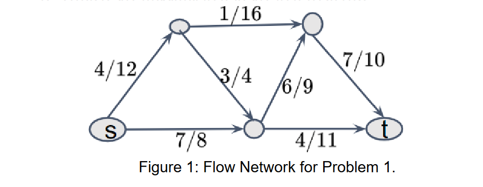
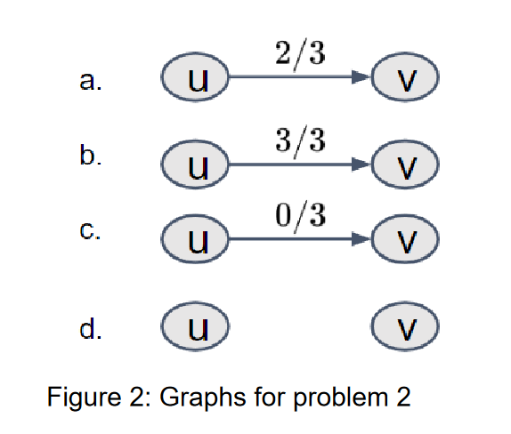
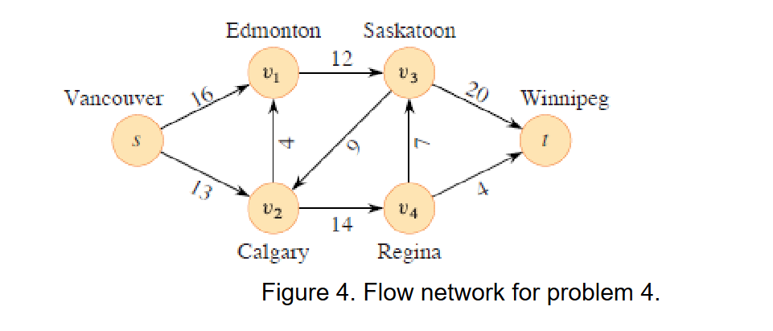

## Exercises:

1. Check that the network in Figure 1 represents a valid flow. What do you need to change to violate:
    - a. The capacity constraint, and
    **Answer:** increase more than the capacity of the given edge so e.g: $11/10$?
    - b. Flow conservation
    **Answer:** Decreasing the capacity of the edges.
    - c. What is the maximal flow in the flow network?
    **Answer:** $4+7=11$ since there is no other there is larger than 11 in the flow network.

2. For each of the situations in Figure 2, compute the residual capacities $c_f(u,v)$ and $c_f(v,u)$.

**Answer:**
- a: (u)<-2-(v), (u)-1->(v)
- b: (u)<-3-(v)
- c: (u)-3->(v)
- d: *???*

3. Professor Adam has two children who, unfortunately, dislike each other.
The problem is so severe that not only do they refuse to walk to school together, but each one refuses to walk on any block that the other child has stepped on that day.
The children have no problem with their paths crossing at a corner. Fortunately, both the professor’s house and the school are on corners, but beyond that, he is not sure if it is going to be possible to send both of his children to the same school.
The professor has a map of his town. Show how to formulate the problem of determining whether both his children can go to the same school as a maximum flow problem.

**Answer:**

*Courtesy of Chad GPT:* To formulate the problem of determining whether both of Professor Adam's children can go to the same school as a maximum flow problem, we can model it using a graph. Here's how you can do it:

1. **Create Nodes:**
   - Create a node for each block in the town. Include nodes for the professor's house and the school, as well as additional nodes at each street corner.

2. **Assign Capacities:**
   - Assign capacities to the edges between nodes. The capacity represents the maximum number of times a block can be stepped on in a day.
   - Assign a capacity of 1 to the edges connecting each block to the corner nodes. This ensures that each block can only be stepped on once per path.
   - Assign a capacity of infinity to the edges connecting the corner nodes to the professor's house and the school, as these represent paths where the children can cross without any issue.

3. **Create Source and Sink:**
   - Introduce a source node and connect it to the corner nodes around the professor's house.
   - Introduce a sink node and connect it to the corner nodes around the school.

4. **Define Flows:**
   - Define the flow through the edges based on the paths the children take. The flow should be 0 or 1 for each edge, representing whether a block is stepped on or not.

5. **Objective Function:**
   - Maximize the total flow from the source to the sink, representing the children walking to school.

6. **Constraints:**
   - Ensure that the flow is conserved at each node, except for the source and sink nodes.
   - Ensure that the flow through each edge does not exceed its capacity.

7. **Solve the Maximum Flow Problem:**
   - Use a maximum flow algorithm (e.g., Ford-Fulkerson algorithm) to find the maximum flow from the source to the sink.

8. **Evaluate the Result:**
   - If the maximum flow is equal to the sum of the capacities of the edges connected to the source, then both children can go to the same school.

By solving the maximum flow problem, you are essentially finding the maximum number of feasible paths from the source to the sink, taking into account the children's constraints on stepping on blocks. If the maximum flow equals the sum of the capacities leaving the source, it means both children can go to the same school while adhering to their conditions. 

4. Show the execution of the Edmonds-Karp algorithm on the flow network in Figure 4.

**Answer:** minium distance for the augmented paths as Breadth first search?.

5. Implement the Edmonds-Karp and Ford-Fulkerson algorithms in any programming language of your choice.
Test your implementation using the flow network in Figure 4.

**Answer:** Not needed for exam :)

