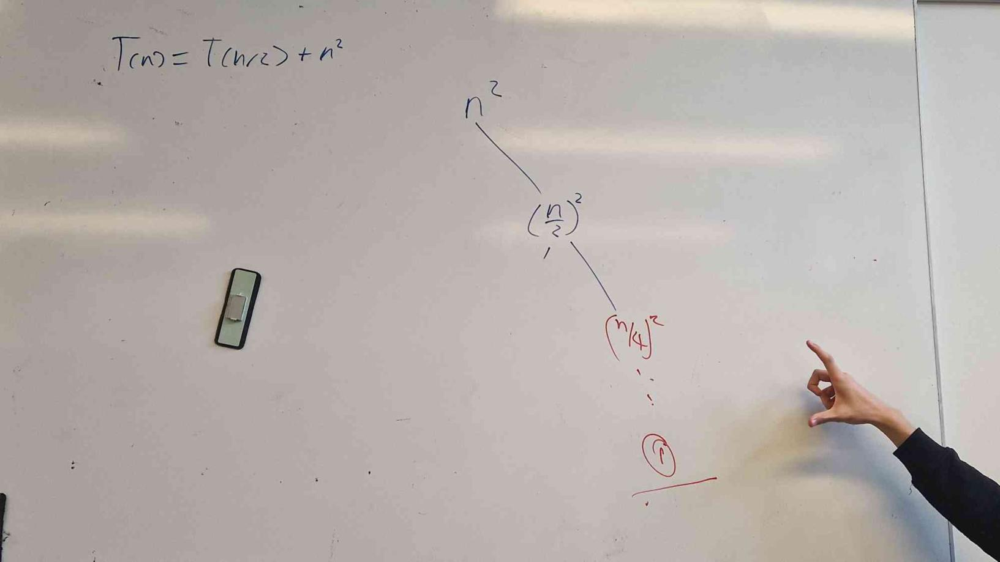
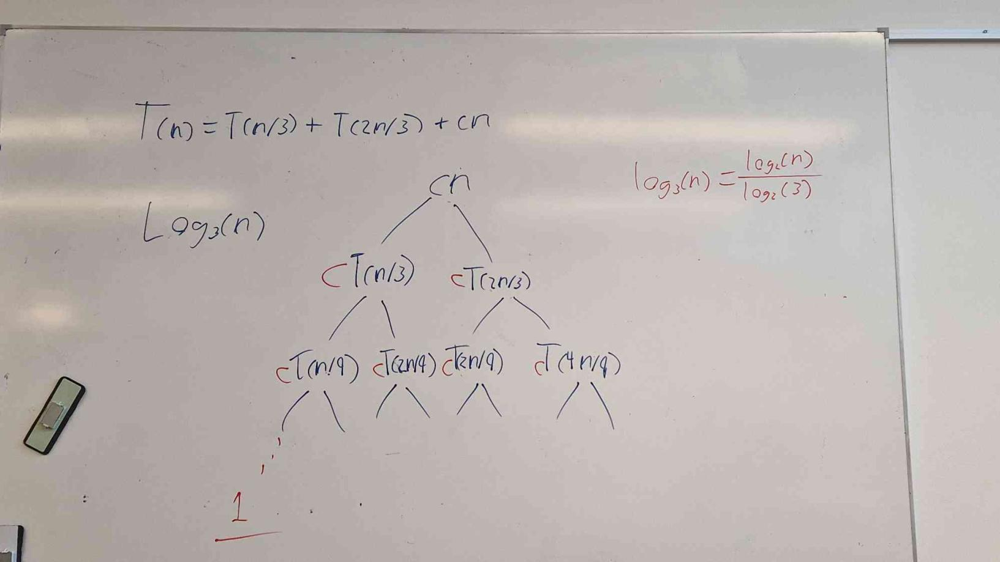

# Algorithms 2 - exercises

## Exercise 1

We can extend the notations to the case of two parameters n and m that can go to $\infty$
independently at different rates. For a given function $g(n,m)$, we denote by $O(g(n,m))$ the set
of functions
$$
O(g(n,m)) = \{f(n,m): \text{there exist positive constants } c, n_0, \text{ and } m_0 \text{ such that } \\0 \le f(n,m) \le c g(n,m) \text{ for all } n \ge n_0 \text{ and } m \ge m_0\}
$$
Give the corresponding definitions for $\Omega(g(n,m))$ and $\Theta(g(n,m))$

$$
\Theta(g(n,m)) = \{f(n,m): \text{there exist positive constants } c_1, c_2, n_0, \text{ and } m_0 \text{ such that } \\0 \le c_1 g(n,m) \le f(n, m) \le c_2 g(n,m) \text{ for all } n \ge n_0 \text{ and } m \ge m_0\}
$$

$$
\Omega(g(n,m)) = \{f(n,m): \text{there exist positive constants } c, n_0, \text{ and } m_0 \text{ such that } \\0 \le c g(n,m) \le f(n,m) \text{ for all } n \ge n_0 \text{ and } m \ge m_0\}
$$

## Exercise 2

a. Use a recursion tree to determine a good asymptotic upper bound on the recurrence $T(n) = T(\frac{n}{2}) + n^2$

b. Verify your answer in (a) using the substitution method.

Certainly! Let's solve the recurrence relation $T(n) = T\left(\frac{n}{2}\right) + n^2$ using the substitution method to find an upper bound.

Guess the Form of the Solution: We will guess that the solution to the recurrence relation is $T(n) = O(n^2)$.
This is based on the fact that the recurrence contains $n^2$ and a division by 2 in each step, which suggests that the solution might be quadratic.

Inductive Hypothesis: Assume $T(k) \leq c \cdot k^2$ for all $k < n$, where $c$ is a positive constant to be determined.

Base Case: For $n = 1$, $T(1) = 1^2 = 1$, and $c \cdot 1^2 = c$.
The base case holds for any positive value of $c$.

Inductive Step: Assume $T(k) \leq c \cdot k^2$ for all $k < n$.

$$
T(n) = T\left(\frac{n}{2}\right) + n^2 \\
\leq c \cdot \left(\frac{n}{2}\right)^2 + n^2 \quad \text{(by the inductive hypothesis)} \\
= c \cdot \frac{n^2}{4} + n^2 \\
= \left(\frac{c}{4} + 1\right) \cdot n^2.
$$

Solve for Constants: We want $T(n) \leq \left(\frac{c}{4} + 1\right) \cdot n^2$ to hold.

To make it an upper bound, we can set $c = 4$, so we have:
$T(n) \leq \left(\frac{4}{4} + 1\right) \cdot n^2 = 2 \cdot n^2.$

Prove the Upper Bound: To prove this is an upper bound, you can use mathematical induction or other appropriate techniques.

So, in this case, we have shown that $T(n)$ is bounded by $2 \cdot n^2$, which implies that $T(n)$ is $O(n^2)$ as guessed initially.
This is the upper bound for the given recurrence relation.

c. Argue that the solution to the recurrence $T(n) = T(\frac{n}{3}) + T(\frac{2n}{3}) + cn$, where $c$ is a constant, is $\Omega(n \log_2(n))$

## Exercise 3

Skipped since its the same as exercise 2

## Exercise 4

Using the master method, write the asymptotic estimate for the following recurrences:

a., b. and d. skipped as it is the same as the others.

c. $T(n) = 4T(\frac{n}{2}) + n^3$

Master method works on $T(n) = aT(\frac{n}{b}) + f(n)$, where $a>0, b>1$.

Slide page 23.

$$
a = 4\\
b=2\\
f(n)=n^3
$$

Case 3 holds.

$$
n^3 = O(n^{log_2(4) + \varepsilon}), \text{ where } \varepsilon > 0 \text{ and } 4 \Big(\frac{n}{2}\Big)^3 = \frac{n^3}{2} \le c n^3 \text{ for some } c \le 1
$$

Since both conditions are fulfilled (when $\varepsilon = 1$), condition 3 holds.

$$
T(n) = \Theta(n^3)
$$
