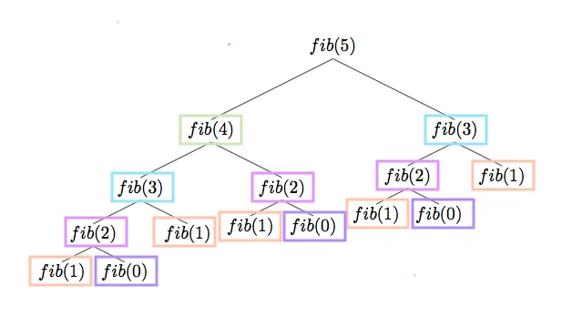

# Dynamic Programming Problems

## 1. DP for Fibonacci Sequence

The Fibonacci numbers are defined by recurrence:
- F(i) = 0; i = 0,
- F(i) = 1; i = 1,
- F(i) = F(i-1) + F(i-2); i ≥ 2

### a. Linear-Time Dynamic Programming Algorithm
Give a linear-time dynamic-programming algorithm to compute the nth Fibonacci number.

**Solution 1**(Memoized)
```
function memoizedFib(n, memo={}){
    if (memo[n]){
        return memo[n];
    }
    else if (n === 0 || n === 1){
        return 1;
    }
    let result = memoizedFib(n-1, memo) + memoizedFib(n-2, memo);
    memo[n] = result;
    return result;
}
```
**Solution 2** (Bottom up)
```
function tabulatedFib(n){  
    if (n === 1 || n === 2){
        return 1;
    }
    const fibNums = [0, 1, 1];

    for (let i = 3; i <= n; i++){
        fibNums[i] = fibNums[i-1] + fibNums[i-2];  
    }
    return fibNums[n];
}
```
Both methods has a linear time compelxity of O(n)

### b. Subproblem Graph
Draw the subproblem graph.

**Solution**

Stolen from the internet

### c. Graph Statistics
How many vertices and edges does the graph in (b) contain?

**Solution** 
The graph is essentially a binary tree with $n + 1$ vertices(nodes).
Each node(except the first two) has two edges, therefore the number of edges will be $2 * n$

### d. Algorithm Implementation
Implement your algorithm in (a) and verify that it works.

**Solution** (Bottom up in python)
Chosen because i get recursion error with memoize method
```python
def fibonacci(n):
    if n <= 1:
        return n

    fib = [0] * (n + 1)
    fib[1] = 1

    for i in range(2, n + 1):
        fib[i] = fib[i - 1] + fib[i - 2]

    return fib[n]

# Example usage:
n = 10
result = fibonacci(n)
print(f"The {n}-th Fibonacci number is {result}")
```

## 2. Modified Rod-Cutting Problem

Consider a modification of the rod-cutting problem where each cut incurs a fixed cost.

### a. Dynamic Programming Algorithm
Give a dynamic-programming algorithm to solve this modified problem.

**Solution** (Implemented in python with Bottom up approach)
```python
def modified_rod_cutting(price, length, cost):
    n = len(price) #length of price list to create array
    revenue = [0] * (n + 1) #Creates array to store maximum revenues

    for i in range(1, n + 1): #iterates through possible lengths of the rod
        max_revenue = -float('inf') #keeps track of maximum revenue for current rod length i
        for j in range(i): # iterates through the possible cuts for the rod length i
            max_revenue = max(max_revenue, price[j] + revenue[i - j - 1] - (j + 1) * cost)# calculates the max revenue at the current cut + the remainign length i
        revenue[i] = max_revenue #updtes max revenue array

    return revenue[n]

# Example usage:
price = [1, 5, 8, 9, 10, 17, 17, 20]
length = len(price)
cost = 2
result = modified_rod_cutting(price, length, cost)
print(f"The maximum revenue is {result}")
```
The algorithm repeats these steps for each possible rod length, starting from shorter rods and building up to the desired rod length. Once the loop completes, the revenue array contains the maximum revenue for each rod length. Finally, the algorithm returns the maximum revenue for the specified rod length, which is revenue[n].


### b. Algorithm Verification
Use the data provided in the table for the rod-cutting problem to verify that your algorithm works correctly.

**Solution**
The algorithm can be verified by running the above code and seeing that it spits out the correct cost compared to ramonis table i guess?

### c. Running Time Analysis
Analyze the running time of your algorithm in (a).

**Solution**
The running time of the algorithm must be $O(n^2)$ because of the nested for loops?

## 3. Change-Making

Consider the problem of making change for n cents using the smallest number of coins.

### a. Greedy Algorithm
Describe a greedy algorithm to make change consisting of quarters (25 cents), dimes (10 cents), nickels (5 cents), and pennies (1 cent). Prove that your algorithm yields an optimal solution.

### b. Greedy Algorithm with Powers of c
Suppose that the available coins are in denominations that are powers of c: the denominations are c^0, c^1, … , c^k for some integers c > 1 and k ≥ 1. Show that the greedy algorithm always yields an optimal solution.

### c. Non-Optimal Greedy Solution
Give a set of coin denominations for which the greedy algorithm does not yield an optimal solution. Your set should include a penny so that there is a solution for every value of n.

### d. Algorithm for Smallest Number of Coins
Give an O(nk)-time algorithm that makes change for any set of k different coin denominations using the smallest number of coins, assuming that one of the coins is a penny.

### e. Algorithm Implementation
Implement the greedy algorithm in (a) and verify that it works.
