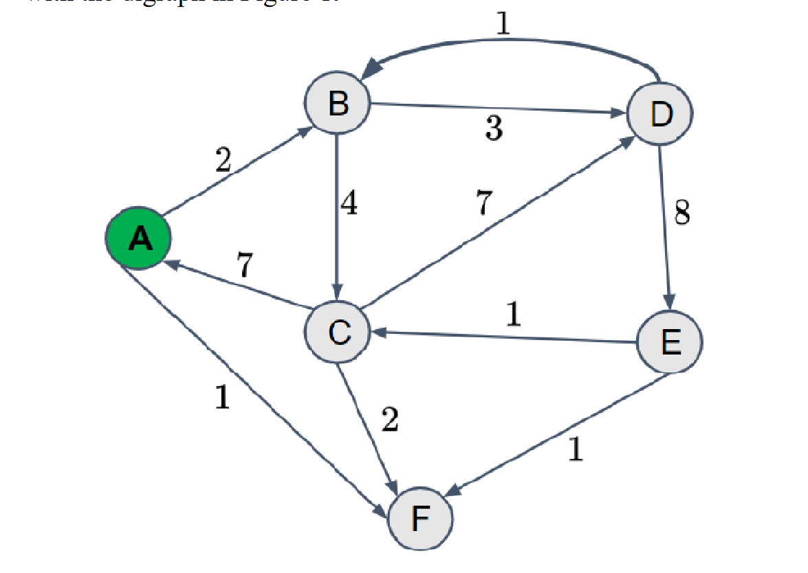
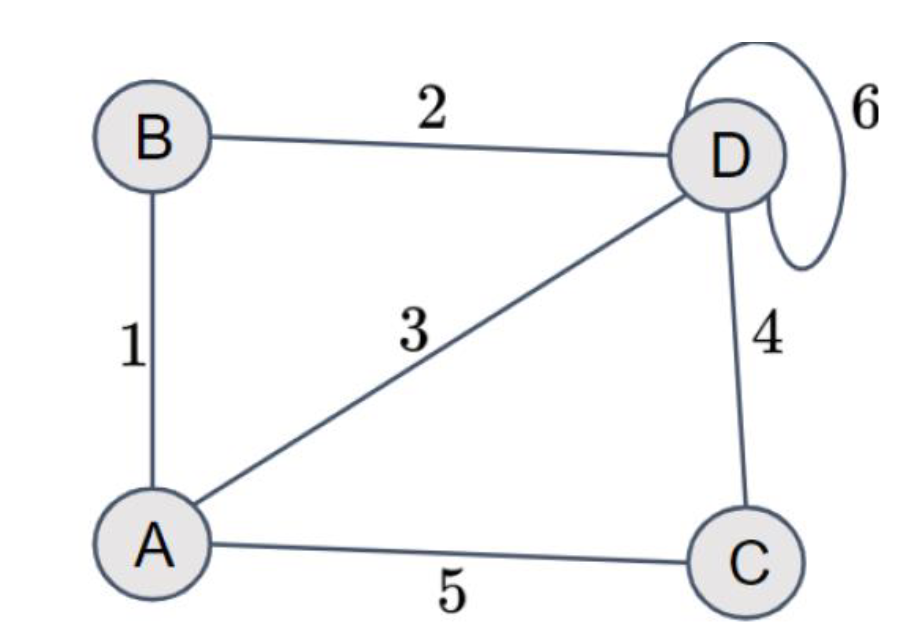

# Algorithms 9 - exercises

## Excercise 1:
Consider the weighted directed graph, G in Figure 1.



a. Represent the graph as a weighted adjacency matrix.

|   | A | B | C | D | E | F |
|---|---|---|---|---|---|---|
| A | 0 | 2 | 0 | 0 | 0 | 1 |
| B | 0 | 0 | 4 | 3 | 0 | 0 |
| C | 7 | 0 | 0 | 7 | 0 | 2 |
| D | 0 | 1 | 0 | 0 | 8 | 0 |
| E | 0 | 0 | 1 | 0 | 0 | 1 |
| F | 0 | 0 | 0 | 0 | 0 | 0 |

b. Using your result in a, calculate the weight, w(G) of the graph.

Sum all the non-zero entries in the matrix.
$$
2+1+4+3+7+7+2+1+8+1+1=37
$$

c. Show how Dijkstra's algorithm works on the graph in Figure 2. Take vertex, A, as the source.

1. Step 1: start

| Vertex | Shortest distance from A | Previous vertex |
|--------|--------------------------|-----------------|
| A      | 0                        |                 |
| B      | $\infty$                 |                 |
| C      | $\infty$                 |                 |
| D      | $\infty$                 |                 |

2. Step 2: we in A

| Vertex | Shortest distance from A | Previous vertex |
|--------|--------------------------|-----------------|
| A      | 0                        |                 |
| B      | 1                        | A               |
| C      | 5                        | A               |
| D      | 3                        | A               |

3. Step 3: we in B

| Vertex | Shortest distance from A | Previous vertex |
|--------|--------------------------|-----------------|
| A      | 0                        |                 |
| B      | 1                        | A               |
| C      | 5                        | A               |
| D      | 3                        | A               |

4. Step 4: we in D

| Vertex | Shortest distance from A | Previous vertex |
|--------|--------------------------|-----------------|
| A      | 0                        |                 |
| B      | 1                        | A               |
| C      | 5                        | A               |
| D      | 3                        | A               |

5. Step 5: we in C

| Vertex | Shortest distance from A | Previous vertex |
|--------|--------------------------|-----------------|
| A      | 0                        |                 |
| B      | 1                        | A               |
| C      | 5                        | A               |
| D      | 3                        | A               |

d. What happens if the weight of (C,A) is set to w(C, A) = −7?

1. Step 1: start

| Vertex | Shortest distance from A | Previous vertex |
|--------|--------------------------|-----------------|
| A      | 0                        |                 |
| B      | $\infty$                 |                 |
| C      | $\infty$                 |                 |
| D      | $\infty$                 |                 |

2. Step 2: we in A

| Vertex | Shortest distance from A | Previous vertex |
|--------|--------------------------|-----------------|
| A      | 0                        |                 |
| B      | 1                        | A               |
| C      | -7                       | A               |
| D      | 3                        | A               |

3. Step 3: we in C

| Vertex | Shortest distance from A | Previous vertex |
|--------|--------------------------|-----------------|
| A      | 0                        |                 |
| B      | 1                        | A               |
| C      | -7                       | A               |
| D      | -3                       | C               |

4. Step 4: we in D

| Vertex | Shortest distance from A | Previous vertex |
|--------|--------------------------|-----------------|
| A      | 0                        |                 |
| B      | -1                       | D               |
| C      | -7                       | A               |
| D      | -3                       | C               |

5. Step 5: we in B

| Vertex | Shortest distance from A | Previous vertex |
|--------|--------------------------|-----------------|
| A      | 0                        |                 |
| B      | -1                       | D               |
| C      | -7                       | A               |
| D      | -3                       | C               |

e. Show how the Bellman-Ford algorithm works on the modified graph.

f. Implement Dijkstra’s and Bellman-Ford’s algorithm. Test your implementation with the digraph in Figure 1.

```py
import heapq

def dijkstra(graph, start):
    distances = {vertex: float('infinity') for vertex in graph}
    distances[start] = 0
    priority_queue = [(0, start)]

    while priority_queue:
        current_distance, current_vertex = heapq.heappop(priority_queue)

        if current_distance > distances[current_vertex]:
            continue

        for neighbor, weight in graph[current_vertex].items():
            distance = current_distance + weight
            if distance < distances[neighbor]:
                distances[neighbor] = distance
                heapq.heappush(priority_queue, (distance, neighbor))

    return distances

# Example Usage for Dijkstra's Algorithm
graph_dijkstra = {
    'A': {'B': 1, 'C': 4},
    'B': {'A': 1, 'C': 2, 'D': 5},
    'C': {'A': 4, 'B': 2, 'D': 1},
    'D': {'B': 5, 'C': 1}
}

start_vertex_dijkstra = 'A'
result_dijkstra = dijkstra(graph_dijkstra, start_vertex_dijkstra)
print(f"Dijkstra's Shortest Distances from {start_vertex_dijkstra}: {result_dijkstra}")
```

```py
def bellman_ford(graph, start):
    distances = {vertex: float('infinity') for vertex in graph}
    distances[start] = 0

    for _ in range(len(graph) - 1):
        for current_vertex in graph:
            for neighbor, weight in graph[current_vertex].items():
                distance = distances[current_vertex] + weight
                if distance < distances[neighbor]:
                    distances[neighbor] = distance

    # Check for negative cycles
    for current_vertex in graph:
        for neighbor, weight in graph[current_vertex].items():
            if distances[current_vertex] + weight < distances[neighbor]:
                raise ValueError("Graph contains a negative cycle")

    return distances

# Example Usage for Bellman-Ford Algorithm
graph_bellman_ford = {
    'A': {'B': -1, 'C': 4},
    'B': {'A': 1, 'C': 2, 'D': 5},
    'C': {'A': 4, 'B': 2, 'D': 1},
    'D': {'B': 5, 'C': 1}
}

start_vertex_bellman_ford = 'A'
result_bellman_ford = bellman_ford(graph_bellman_ford, start_vertex_bellman_ford)
print(f"Bellman-Ford Shortest Distances from {start_vertex_bellman_ford}: {result_bellman_ford}")
```

## Excercise 2:
Consider the graph, G in Figure 2 below.



a. Draw all spanning trees of G.

b. Calculate the weight of all spanning trees in G and find the minimal spanning tree.

c. Find two cuts in the graph with weight equal to 12.

- Option 1: group A is B and C, and group B is A and D

## Excercise 3:
List at least two example problems for each of the four types of SPPs mentioned in the lecture slides.

#### Single-Source SPP:
* Navigation System:
    - Problem: In a city with a road network, find the shortest path from a specified starting point (source) to all other locations in the city.
    - Application: GPS navigation systems where the user wants to find the quickest route from their current location to various destinations.
* Routing in Computer Networks:
    - Problem: In a computer network, find the shortest path from a source router to all other routers in the network.
    - Application: Routing algorithms in computer networks use single-source SPP to determine the best path for data packets to travel from one router to another.

#### Single-Destination SPP:
* Flight Connections:
    - Problem: In an airline network, find the shortest paths from all airports to a specified destination airport.
    - Application: An airline wants to optimize flight connections from various airports to a central hub.

* Public Transportation:
    - Problem: In a city's public transportation system, find the shortest paths from all bus stops to a specified central transit station.
    - Application: Public transportation planning where the central station serves as a major transit hub.

#### Single-Pair SPP:
* Delivery Route Optimization:
    - Problem: Given a road network, find the shortest path between a specific pair of locations, optimizing for delivery routes.
    - Application: Delivery companies aim to find the most efficient path for delivering packages from a warehouse to a customer's address.

* Data Transmission in Networks:
    - Problem: In a communication network, find the shortest path between a pair of nodes to optimize data transmission.
    - Application: Telecommunication networks where the goal is to minimize the delay in transmitting data between two specific points.

#### All-Pairs SPP:
* Traffic Planning:
    - Problem: In a city with a road network, find the shortest paths between all pairs of intersections to optimize traffic flow.
    - Application: City planners use this to design efficient traffic systems and reduce congestion.

* Resource Allocation in Data Centers:
    - Problem: In a data center network, find the shortest paths between all pairs of servers to optimize resource allocation.
    - Application: Data centers need efficient routing to minimize latency and improve overall performance in transferring data between servers.

## Excercise 4:
Give a simple example of a connected graph such that the set of edges {(u,v):
there exists a cut(S,V-S) such that (u,v) is a light edge crossing (S,V-S)}
does not form a minimum spanning tree.

## Excercise 5:
Kruskal and Prim’s algorithm

a. Using the link available on Moodle, try the visualizations of Kruskal’s and Prim’s algorithms

Ok, done.

b. Make a weighted graph and run Kruskal’s and Prim’s algorithms on it.

Ok, done.

c. Make a weighted graph in MATLAB and try MATLAB’s function to construct a minimum spanning tree. Find out which algorithm MATLAB runs and why.

Haha matlab go pls no.
